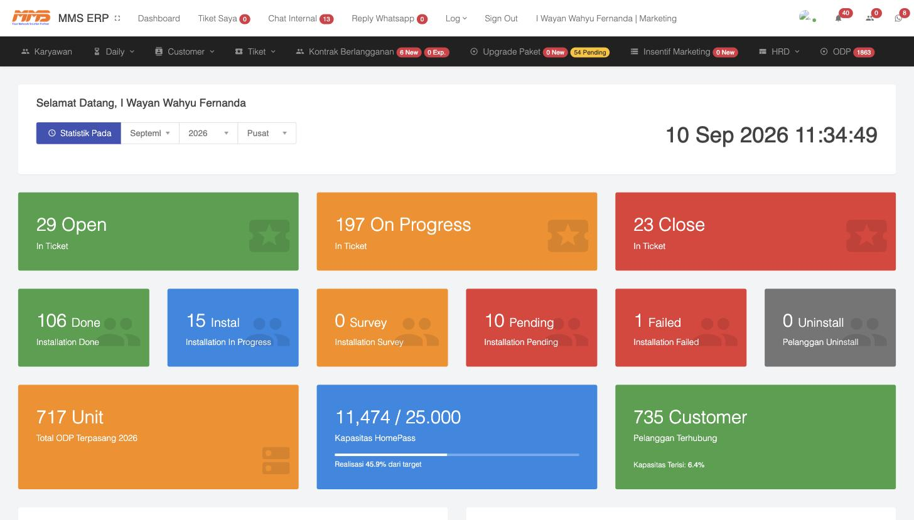

# 1. Pengenalan Sistem & Login

## 1.1 Apa itu MMS ERP?

**MMS ERP** adalah sistem manajemen internal milik **PT. Megarap Mitra Solusi (MMS NET)** — penyedia layanan internet (ISP) — yang mengelola seluruh siklus bisnis pelanggan mulai dari pemasaran, survey, instalasi, kontrak berlangganan, penagihan, hingga administrasi karyawan (HRD).

- **URL Sistem:** `https://help.mms.net.id`
- **Jenis akses:** Berbasis login dengan level/role berbeda (Marketing, Teknisi/Technical Support, Finance, HRD, Direktur, NOC, dsb). Menu yang tampil menyesuaikan role pengguna yang login.

## 1.2 Cara Login

1. Buka browser, akses `https://help.mms.net.id`.
2. Masukkan **Username** dan **Password** akun Anda.
3. Setelah berhasil, Anda akan diarahkan ke halaman **Dashboard**.

> Jika sesi login tersimpan di browser, sistem akan otomatis membawa Anda ke Dashboard tanpa perlu login ulang.

## 1.3 Tampilan Dashboard



Dashboard menampilkan ringkasan statistik operasional secara real-time, di antaranya:

| Widget | Keterangan |
|---|---|
| **Open / On Progress / Close (In Ticket)** | Jumlah tiket helpdesk berdasarkan status |
| **Done / Instal / Survey / Pending / Failed / Uninstall** | Status instalasi pelanggan baru |
| **Total ODP Terpasang** | Jumlah unit ODP (titik distribusi jaringan) yang sudah terpasang tahun berjalan |
| **Kapasitas HomePass** | Kapasitas total rumah yang bisa dijangkau jaringan vs realisasi terpakai |
| **Total Customer** | Jumlah pelanggan yang terhubung aktif |
| **Absen Briefing** | Daftar kehadiran briefing harian karyawan lapangan |
| **Daily Activity** | Log aktivitas harian tim |

Di bagian atas terdapat filter **Statistik Pada** (Bulan / Tahun / Wilayah) — berguna untuk melihat performa per wilayah, misalnya **Pusat** vs **Cabang - Bandar Jaya**. Ini menunjukkan bahwa data di sistem sudah terpisah/terfilter per **Cabang**.

## 1.4 Struktur Menu Utama

Menu navigasi kedua (bar hitam di bawah header) adalah pusat kendali seluruh proses bisnis:

| Menu | Isi Submenu |
|---|---|
| **Karyawan** | Data Karyawan (seluruh pegawai MMS, lintas divisi & cabang) |
| **Daily** | Daily Activity, Komplain |
| **Customer** | Customer (pelanggan aktif), Calon Customer, FU Blokir, FU Calon Customer, Upgrade Request |
| **Tiket** | Tiket (helpdesk), Progress Tiket, Tiket Saya, ODP Coverage |
| **Kontrak Berlangganan** | Dokumen kontrak pelanggan |
| **Upgrade Paket** | Approval permintaan naik/turun paket |
| **Insentif Marketing** | Komisi tim marketing |
| **HRD** | Form Lembur, Form Cuti/Izin, Op. Kendaraan, Tugas Luar Kota, Absensi, Peminjaman Barang |
| **ODP** | Data titik distribusi jaringan (Optical Distribution Point) |

Menu di bagian kanan atas (**Tiket Saya**, **Chat Internal**, **Reply Whatsapp**, **Log**) adalah alat komunikasi & tugas pribadi pengguna yang sedang login.

## 1.5 Alur Bisnis Singkat

Secara garis besar, sistem ini mengikuti alur:

```
Calon Customer (Marketing) → Proses Instalasi → Tiket Instalasi (Teknisi/Cabang/POP)
   → Kontrak Berlangganan → Customer Aktif → Invoice/Penagihan → Komisi Marketing
```

Detail tiap tahap dijelaskan pada bab-bab selanjutnya.
