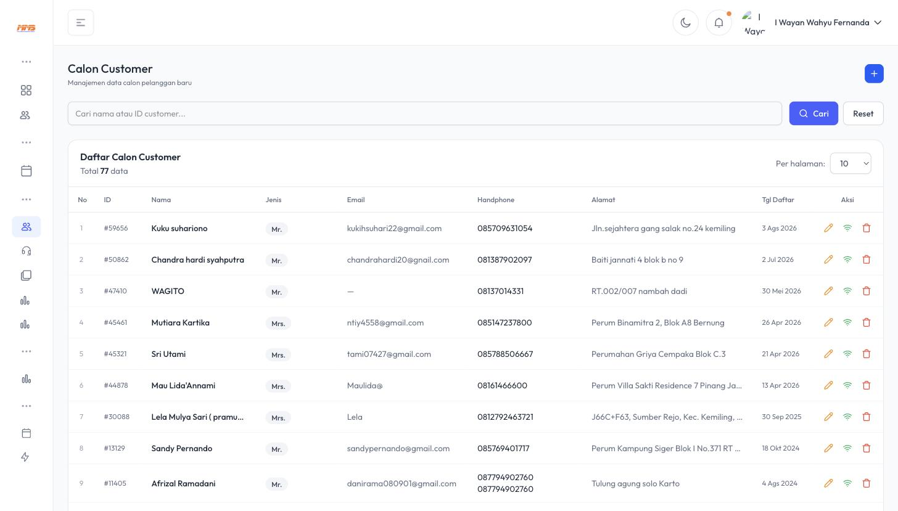
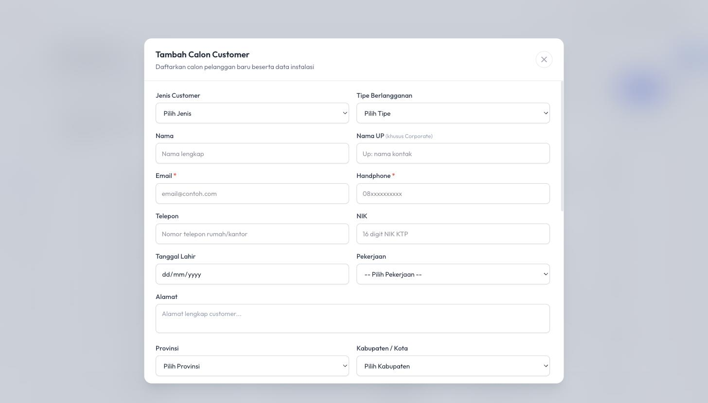
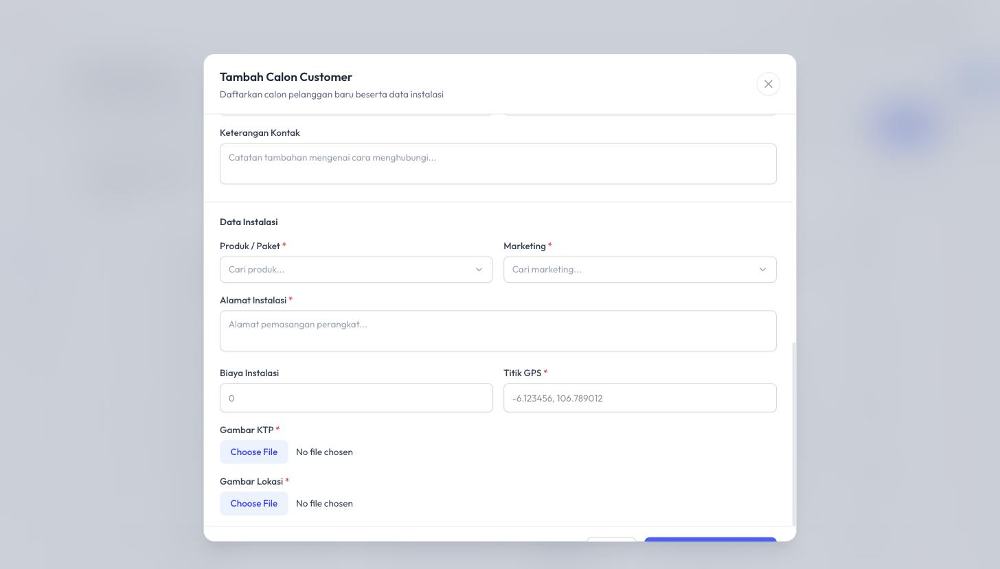
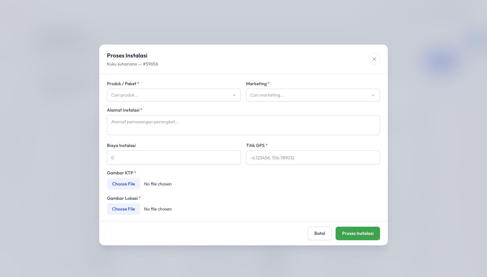

# 2. Kantor Pemasaran (Marketing) — Calon Customer & Proses Instalasi

Modul ini adalah **titik awal** dari seluruh proses bisnis MMS. Tim Marketing/Kantor Pemasaran bertugas mencari prospek pelanggan baru, mendata mereka di sistem, lalu meneruskannya menjadi order instalasi.

## 2.1 Menu Terkait Marketing

Dari menu **Customer** di navbar, tim marketing memiliki akses ke:

- **Customer** — daftar pelanggan yang sudah aktif/terdaftar
- **Calon Customer** — daftar prospek yang belum jadi pelanggan
- **FU Blokir** — daftar pelanggan yang diblokir (untuk di-follow-up agar membayar tunggakan)
- **FU Calon Customer** — daftar prospek yang perlu ditindaklanjuti (follow-up)
- **Upgrade Request** — permintaan upgrade paket dari pelanggan

## 2.2 Mendaftarkan Calon Customer Baru

Ini adalah **langkah pertama** dalam siklus penjualan.

1. Buka menu **Customer → Calon Customer**.
2. Anda akan melihat **Daftar Calon Customer** — berisi seluruh prospek yang pernah didaftarkan, lengkap dengan ID, Nama, Jenis (Mr./Mrs.), Email, No. HP, Alamat, dan Tanggal Daftar.

   

3. Klik tombol **`+`** (biru, pojok kanan atas) untuk membuka form **Tambah Calon Customer**.

   

4. Isi **Data Diri Calon Pelanggan**:
   - **Jenis Customer** — Perorangan/Corporate, dsb.
   - **Tipe Berlangganan**
   - **Nama** & **Nama UP** (khusus untuk pelanggan Corporate — nama contact person)
   - **Email** * (wajib) dan **Handphone** * (wajib)
   - **Telepon**, **NIK**, **Tanggal Lahir**, **Pekerjaan**
   - **Alamat lengkap**, **Provinsi**, **Kabupaten/Kota**, **Kecamatan**, **Desa/Kelurahan**
   - **Facebook / Instagram** (opsional, untuk data kontak tambahan)
   - **Keterangan Kontak** (catatan cara menghubungi terbaik)

5. Isi bagian **Data Instalasi** (bagian bawah form yang sama):

   

   - **Produk / Paket** * — pilih paket internet yang diminati calon pelanggan
   - **Marketing** * — pilih nama marketing yang menangani (untuk keperluan komisi nanti)
   - **Alamat Instalasi** * — alamat pemasangan perangkat (bisa berbeda dari alamat pribadi)
   - **Biaya Instalasi** — nominal biaya pasang baru (jika ada)
   - **Titik GPS** * — koordinat lokasi pemasangan (format: `-6.123456, 106.789012`), penting untuk survey teknisi & pengecekan jangkauan ODP terdekat
   - **Gambar KTP** * — upload foto KTP calon pelanggan
   - **Gambar Lokasi** * — upload foto lokasi pemasangan

6. Klik **Simpan & Proses Instalasi** untuk menyimpan data sekaligus (opsional) langsung memproses instalasi, atau **Batal** untuk membatalkan.

> 💡 **Tips:** Field bertanda bintang merah (*) wajib diisi. Pastikan Titik GPS akurat karena akan dipakai teknisi untuk survey lokasi & pengecekan ketersediaan ODP terdekat.

## 2.3 Memproses Calon Customer Menjadi Instalasi

Jika saat pendaftaran awal data instalasi belum lengkap, atau Anda ingin memproses ulang prospek yang sudah ada di daftar:

1. Di halaman **Daftar Calon Customer**, cari baris nama calon pelanggan yang dituju.
2. Pada kolom **Aksi**, klik ikon **wifi 📶** (biru) untuk membuka modal **Proses Instalasi**.

   

3. Lengkapi/periksa data: **Produk/Paket**, **Marketing**, **Alamat Instalasi**, **Biaya Instalasi**, **Titik GPS**, **Gambar KTP**, **Gambar Lokasi**.
4. Klik tombol hijau **Proses Instalasi**.

**Apa yang terjadi setelah tombol ini diklik?**
Sistem otomatis akan:
- Membuat sebuah **Tiket Instalasi** baru di modul Tiket/Progress Tiket (lihat [Bab 3](03-Instalasi-Cabang-POP.md)), yang akan dikerjakan oleh tim **Teknisi** di **Cabang/POP** terkait wilayah tersebut.
- Data ini menjadi dasar pembuatan **Kontrak Berlangganan** setelah instalasi selesai (lihat [Bab 4](04-Kontrak-dan-Penagihan.md)).

Ikon lain di kolom Aksi:
- ✏️ **Edit (pensil kuning)** — mengubah data calon customer.
- 🗑️ **Hapus (tempat sampah merah)** — menghapus data calon customer dari daftar.

## 2.4 Follow-Up Calon Customer & Pelanggan Terblokir

- **FU Calon Customer**: gunakan menu ini untuk melihat daftar prospek yang sudah lama didaftarkan namun belum diproses instalasinya — agar tim marketing bisa menghubungi ulang (follow-up) sebelum prospek hilang minat.
- **FU Blokir**: menu ini menampilkan pelanggan yang layanannya sedang **diblokir** karena telat bayar (lihat [Bab 4.4](04-Kontrak-dan-Penagihan.md#44-blokir-layanan-akibat-telat-bayar)) — tim marketing/CS dapat menghubungi pelanggan ini untuk menagih & meminta pembayaran agar layanan aktif kembali.

## 2.5 Insentif / Komisi Marketing

Setiap instalasi yang berhasil dan invoice-nya terbayar akan menghasilkan komisi bagi marketing yang menangani. Detail lengkap ada di [Bab 5 — Insentif Marketing](05-Upgrade-Paket-dan-Insentif.md#52-insentif-marketing-komisi).
