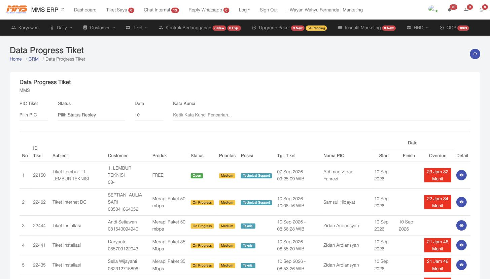
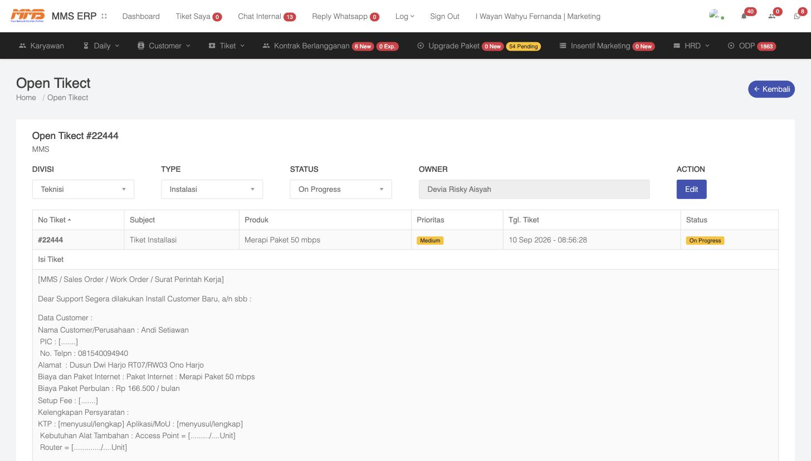

# 3. Instalasi — Cabang & POP (Tiket, Progress Tiket, ODP)

Setelah tim Marketing memproses **Calon Customer** ([Bab 2](02-Kantor-Pemasaran-Marketing.md)), sistem otomatis membuat **Tiket Instalasi**. Tahap ini adalah tanggung jawab tim **Cabang** dan **POP** (Point of Presence) — khususnya divisi **Technical Support / Teknisi** — untuk mengeksekusi pemasangan di lapangan.

## 3.1 Konsep ODP (Optical Distribution Point)

**ODP** adalah titik distribusi kabel fiber optik di lapangan (mirip terminal box) yang menjadi acuan apakah suatu lokasi bisa dijangkau jaringan MMS atau tidak.

Menu **ODP** (navbar atas) menampilkan **Data ODP**:

- **Unit Instalasi** — memilih cabang/unit (misal: MMS NET)
- **Cari Jalur ODP** — pencarian berdasarkan nama jalur/PON
- **Pilih Jalur ODP** — filter berdasarkan jalur tertentu

Kolom data yang ditampilkan per ODP: **Wilayah, Jalur, PON, Spliter, ODP, GPS, Kategori, Vendor, Port, User, Port Available, Created At, Maps**.

> **Kegunaan:** Sebelum instalasi dieksekusi, teknisi/CS bisa mengecek ODP terdekat dari titik GPS calon pelanggan untuk memastikan **Port Available** (slot kosong) masih tersedia. Jika port penuh, perlu penambahan ODP baru atau pelanggan dialihkan ke jalur lain.

Menu **Tiket → ODP Coverage** memberikan fungsi serupa namun dari sisi cakupan (coverage) area layanan per ODP.

## 3.2 Tiket Instalasi

Setiap kali Marketing mengklik **Proses Instalasi** ([Bab 2.3](02-Kantor-Pemasaran-Marketing.md#23-memproses-calon-customer-menjadi-instalasi)), sistem membuat tiket baru dengan **Type: Instalasi**, berformat seperti *Surat Perintah Kerja (SPK)*.

### 3.2.1 Melihat Semua Tiket

Menu **Tiket → Tiket** menampilkan seluruh tiket helpdesk (baik tiket instalasi maupun tiket gangguan/komplain), dengan filter:

- **Status** (Open/On Progress/Close)
- **Prioritas**
- **Divisi**
- **Unit** (cabang/POP)
- **Bulan / Tahun**
- **Kata kunci pencarian**

### 3.2.2 Progress Tiket (Monitoring Pengerjaan)

Menu **Tiket → Progress Tiket** adalah dashboard pemantauan **paling penting** untuk melihat progres pengerjaan instalasi maupun gangguan oleh teknisi:

Kolom-kolom penting:

| Kolom | Keterangan |
|---|---|
| **ID Tiket** | Nomor unik tiket |
| **Subject** | Judul tiket, contoh: "Tiket Installasi - Nardi firdaus" |
| **Customer** | Nama & kontak pelanggan |
| **Produk** | Paket internet yang dipesan |
| **Status** | `Open`, `On Progress`, `Done`, dsb |
| **Prioritas** | Low/Medium/High |
| **Posisi** | Divisi yang sedang menangani, contoh: `Technical Support` atau `Teknisi` — ini menunjukkan tiket sedang berada di tangan siapa |
| **Tgl. Tiket** | Waktu tiket dibuat |
| **Nama PIC** | Petugas/teknisi yang ditugaskan (biasanya dari Cabang/POP setempat) |
| **Start / Finish** | Waktu mulai & selesai pengerjaan |
| **Overdue** | Penghitung mundur/keterlambatan (highlight merah jika mendekati/lewat batas SLA) |

Filter yang tersedia: **PIC Tiket**, **Status**, dan **Kata Kunci**.

### 3.2.3 Detail Tiket Instalasi

Klik ikon mata 👁️ (**Detail**) pada baris tiket untuk membuka halaman **Open Tikect**:

Informasi yang ditampilkan:

- **Header**: Divisi penanggung jawab, Type (Instalasi/Gangguan), Status saat ini, Owner (pembuat tiket)
- **Tabel ringkas**: No Tiket, Subject, Produk, Prioritas, Tanggal, Status
- **Isi Tiket**: format *Surat Perintah Kerja* berisi data lengkap pelanggan —
  - Nama Customer/Perusahaan, PIC, No. Telepon, Alamat
  - Paket Internet & Biaya per bulan
  - Setup Fee
  - Kelengkapan Persyaratan (KTP, Aplikasi/MoU, kebutuhan alat tambahan seperti Access Point/Router)
- **Assignment ke Teknisi**: Nama PIC (teknisi), Level (Teknisi), Start Date, End Date, Batas Akhir Reply Tiket, Status, dan kolom **Laporan** — tempat teknisi mengisi laporan hasil kerja di lapangan (dengan lampiran foto jika ada).
- **Anggota Tiket** — daftar anggota tim lain yang ikut ditugaskan pada tiket ini.
- **Chat Internal** — kolom diskusi/koordinasi khusus tiket ini antara marketing, CS, dan teknisi.

### 3.2.4 Status Instalasi

Berdasarkan Dashboard ([Bab 1.3](01-Pengenalan-Sistem.md#13-tampilan-dashboard)), status instalasi yang dilacak sistem meliputi:

| Status | Arti |
|---|---|
| **Survey** | Instalasi masih tahap survey lokasi/kelayakan |
| **Instal** | Sedang dalam proses pemasangan (Installation In Progress) |
| **Pending** | Instalasi tertunda (misal menunggu material, ODP penuh, dsb) |
| **Failed** | Instalasi gagal dilakukan |
| **Done** | Instalasi selesai — pelanggan siap aktif |
| **Uninstall** | Pelanggan yang perangkatnya dicabut/berhenti berlangganan |

## 3.3 Alur Kerja Teknisi (Cabang/POP)

Ringkasan langkah kerja teknisi setelah menerima tiket instalasi:

1. Terima notifikasi tiket baru pada **Progress Tiket** (Posisi: `Teknisi`).
2. Buka **Detail Tiket**, baca data pelanggan & lokasi (Titik GPS).
3. Datangi lokasi, lakukan survey (cek ODP terdekat via menu **ODP**).
4. Lakukan pemasangan perangkat.
5. Isi **Laporan** pada tiket (hasil pekerjaan + foto bukti bila perlu).
6. Update **Status** tiket menjadi `Done` (jika berhasil) atau `Failed`/`Pending` (jika ada kendala).
7. Setelah status `Done`, tim admin/CS dapat melanjutkan proses ke pembuatan **Kontrak Berlangganan** ([Bab 4](04-Kontrak-dan-Penagihan.md)).

## 3.4 Tiket Gangguan / Komplain

Selain tiket instalasi, sistem juga menangani tiket gangguan layanan pelanggan existing:

- Menu **Daily → Komplain** — mencatat keluhan pelanggan (contoh subjek: "Koneksi Down dan Intermittent", "Internet DC/Down Connection"), lengkap dengan Helpdesk penerima laporan, Shift, PIC/Telepon pelanggan, Teknisi yang menangani, dan Status (`On Progress`/`Done`).
- Tiket dengan Subject seperti "Tiket Internet DC" atau "Tiket Support" pada **Progress Tiket** merupakan tiket gangguan pasca-instalasi (bukan pasang baru), diproses dengan alur serupa namun Type-nya bukan "Instalasi".
