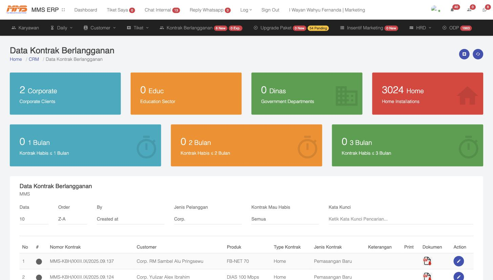
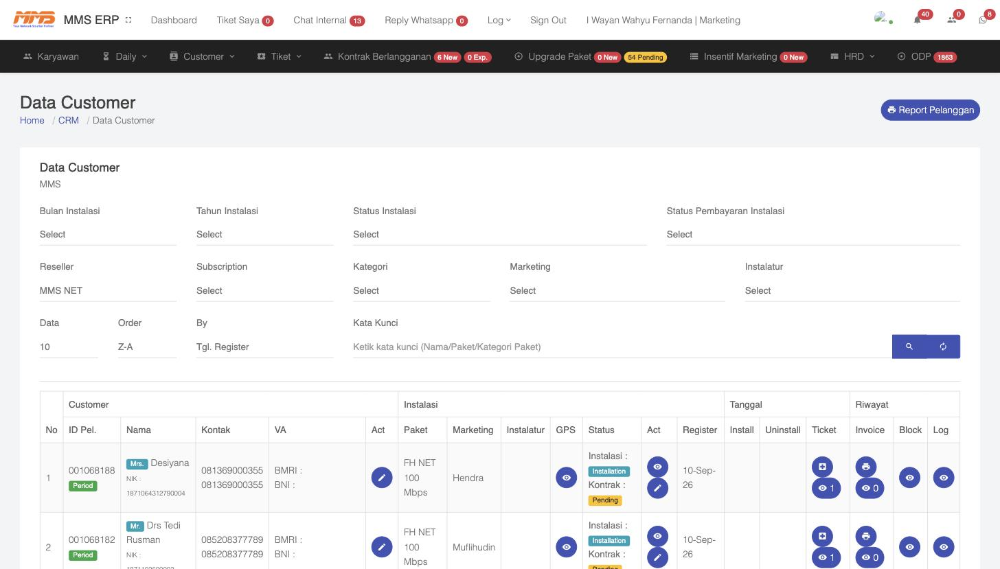
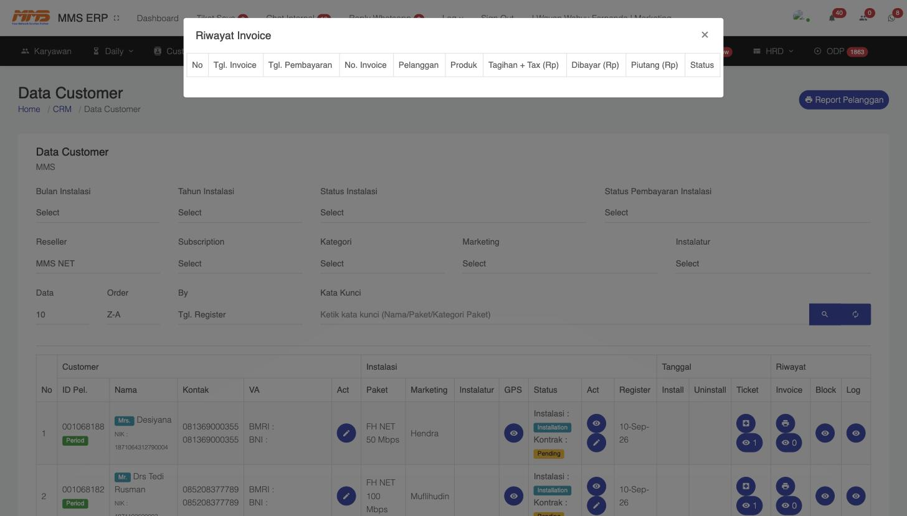
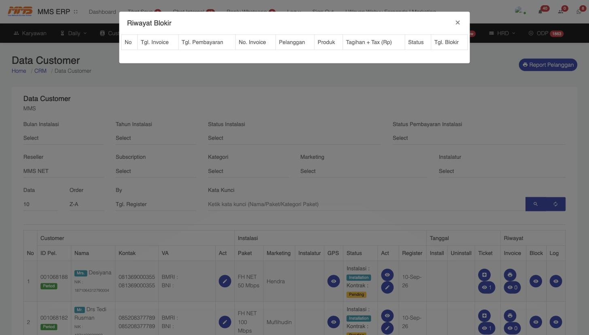

# 4. Kontrak Berlangganan & Penagihan (Billing)

Setelah instalasi berstatus **Done** ([Bab 3](03-Instalasi-Cabang-POP.md)), proses berlanjut ke pembuatan kontrak resmi dan pengelolaan tagihan bulanan pelanggan — modul inti dari **Internal MMS (Finance)** yang dipantau bersama oleh Marketing, Cabang, dan Pusat.

## 4.1 Kontrak Berlangganan

Menu **Kontrak Berlangganan** (navbar atas) menampilkan seluruh dokumen kontrak pelanggan.



### 4.1.1 Ringkasan Statistik Kontrak

Bagian atas halaman menampilkan kartu ringkasan:

- **Corporate / Educ / Dinas / Home** — jumlah kontrak aktif per kategori jenis pelanggan (Perusahaan, Pendidikan, Instansi Pemerintah, Rumah/Perorangan)
- **Kontrak Habis ≤ 1 Bulan / ≤ 2 Bulan / ≤ 3 Bulan** — early warning untuk kontrak yang akan segera berakhir, agar tim bisa follow-up perpanjangan sebelum jatuh tempo

### 4.1.2 Melihat & Mengelola Kontrak

Tabel **Data Kontrak Berlangganan** menampilkan kolom:

| Kolom | Keterangan |
|---|---|
| **Nomor Kontrak** | Format contoh: `MMS-KBH/XXIII/IX/2025.09.137` |
| **Customer** | Nama pelanggan |
| **Produk** | Paket internet |
| **Type Kontrak** | Home/Corporate |
| **Jenis Kontrak** | Pemasangan Baru / Perpanjangan / dsb |
| **Keterangan** | Catatan tambahan |
| **Print** | Ikon PDF untuk mencetak/mengunduh dokumen kontrak |
| **Action** | Ikon edit (pensil) untuk membuka/mengubah detail kontrak |

Filter yang tersedia: **Order** (urutan Z-A/A-Z), **By** (urutkan berdasarkan Created At), **Jenis Pelanggan** (Corp/Home/dsb), **Kontrak Mau Habis**, dan **Kata Kunci**.

### 4.1.3 Detail / Edit Kontrak

Klik ikon **pensil (Action)** untuk membuka **Form Kontrak Berlangganan**, berisi:

- **Nomor Kontrak** (otomatis/manual)
- **No Berlangganan - Customer - Produk - Marketing** (pencarian & penautan ke data pelanggan)
- **Adm. Perangkat Keluar** — nomor tiket instalasi terkait (menghubungkan kontrak dengan tiket instalasi asal, mis. `#11298 - Instalasi`)
- **Jenis Kontrak** — mis. "Pemasangan Baru"
- **Keterangan Kontrak**
- **Tgl Mulai Kontrak** & **Tgl Akhir Kontrak Berlangganan**
- **Lampiran Kontrak** — upload/download dokumen fisik kontrak yang sudah ditandatangani

Tombol **Save** untuk menyimpan perubahan, **Close** untuk menutup tanpa menyimpan.

> 🔗 **Keterkaitan:** Kontrak ini adalah bukti sah bahwa pelanggan resmi berlangganan, dan menjadi acuan tanggal mulai penagihan bulanan berikutnya.

## 4.2 Data Customer (Pusat Data Pelanggan Aktif)

Menu **Customer → Customer** adalah halaman induk untuk memantau **seluruh siklus hidup pelanggan** dari instalasi sampai penagihan dalam satu layar.



### 4.2.1 Filter Pencarian

- **Bulan/Tahun Instalasi**
- **Status Instalasi**
- **Status Pembayaran Instalasi**
- **Reseller** (unit instalasi, mis. MMS NET)
- **Subscription**, **Kategori**, **Marketing**, **Instalatur** (nama teknisi)
- **Kata Kunci** (Nama/Paket/Kategori Paket)

### 4.2.2 Struktur Kolom Tabel

| Grup Kolom | Isi |
|---|---|
| **Customer** | ID Pelanggan, Nama, Kontak, **VA** (Virtual Account bank untuk pembayaran — BMRI/BNI) |
| **Act** | Edit data pelanggan |
| **Instalasi** | Paket, Marketing, Instalatur (teknisi), **GPS** (lihat lokasi di peta), **Status** (status Instalasi & status Kontrak, contoh: `Installation` + `Pending`) |
| **Act** (kedua) | Lihat detail / edit status instalasi |
| **Tanggal** | Register, Install, Uninstall |
| **Riwayat** | **Ticket**, **Invoice**, **Block**, **Log** — empat ikon riwayat penting (dijelaskan di bawah) |

### 4.2.3 Riwayat Ticket

Klik ikon **Ticket** untuk melihat modal **Riwayat Tiket Pelanggan** — seluruh tiket (instalasi maupun gangguan) yang pernah dibuat atas nama pelanggan tersebut, lengkap dengan status dan link ke detail tiket.

## 4.3 Penagihan — Riwayat Invoice

Ini adalah **jantung dari proses Penagihan**. Klik ikon 🖨️ **Invoice** pada baris pelanggan untuk membuka modal **Riwayat Invoice**:



Kolom yang ditampilkan:

| Kolom | Keterangan |
|---|---|
| **Tgl. Invoice** | Tanggal tagihan diterbitkan |
| **Tgl. Pembayaran** | Tanggal pelanggan melakukan pembayaran |
| **No. Invoice** | Nomor unik invoice |
| **Pelanggan** | Nama pelanggan penerima tagihan |
| **Produk** | Paket berlangganan yang ditagih |
| **Tagihan + Tax (Rp)** | Total tagihan termasuk pajak |
| **Dibayar (Rp)** | Jumlah yang sudah dibayarkan pelanggan |
| **Piutang (Rp)** | Sisa tagihan yang belum dibayar (jika ada) |
| **Status** | Status pembayaran (Lunas/Belum Lunas/dsb) |

**Alur penagihan bulanan secara umum:**

1. Setiap bulan, sistem/finance menerbitkan invoice baru untuk tiap pelanggan aktif sesuai tanggal siklus tagihan (mengacu ke **Tgl Mulai Kontrak**).
2. Pelanggan membayar melalui **VA (Virtual Account)** yang tertera di Data Customer, transfer bank, atau kanal pembayaran lain yang didukung.
3. Setelah pembayaran terverifikasi, **Tgl. Pembayaran** & **Status** pada invoice diperbarui menjadi Lunas.
4. Jika ada selisih kurang bayar, sistem mencatatnya sebagai **Piutang**.

## 4.4 Blokir Layanan Akibat Telat Bayar

Jika pelanggan tidak membayar hingga melewati batas jatuh tempo, layanan dapat **diblokir (disuspend)** secara otomatis/manual oleh sistem.

Klik ikon 👁️ **Block** pada baris pelanggan untuk membuka modal **Riwayat Blokir**:



Kolom: **Tgl. Invoice, Tgl. Pembayaran, No. Invoice, Pelanggan, Produk, Tagihan + Tax (Rp), Status, Tgl. Blokir**.

**Alur penanganan pelanggan terblokir:**

1. Invoice jatuh tempo tanpa pembayaran → sistem mencatat **Tgl. Blokir** dan status layanan berubah menjadi non-aktif/diblokir.
2. Pelanggan yang diblokir otomatis masuk ke daftar **Customer → FU Blokir** (lihat [Bab 2.4](02-Kantor-Pemasaran-Marketing.md#24-follow-up-calon-customer--pelanggan-terblokir)) agar tim CS/Marketing dapat menghubungi dan menagih.
3. Setelah pelanggan melunasi tunggakan, admin/finance melakukan **unblokir** agar layanan internet aktif kembali.

## 4.5 Log Aktivitas Pelanggan

Ikon 👁️ **Log** pada baris pelanggan mencatat jejak seluruh perubahan/histori terkait akun pelanggan tersebut (misalnya perubahan paket, perubahan status, dsb) — berguna untuk audit trail bila ada perselisihan data.

---

### Ringkasan Alur Penagihan End-to-End

```
Kontrak Berlangganan aktif
        │
        ▼
Invoice bulanan diterbitkan (Tgl. Invoice)
        │
        ├── Dibayar tepat waktu ──► Status: Lunas ──► Layanan tetap aktif
        │
        └── Tidak dibayar hingga jatuh tempo
                 │
                 ▼
         Layanan diblokir (Riwayat Blokir)
                 │
                 ▼
         Masuk daftar FU Blokir → ditindaklanjuti Marketing/CS
                 │
                 ▼
         Pelanggan bayar tunggakan → Unblokir → Layanan aktif kembali
```
