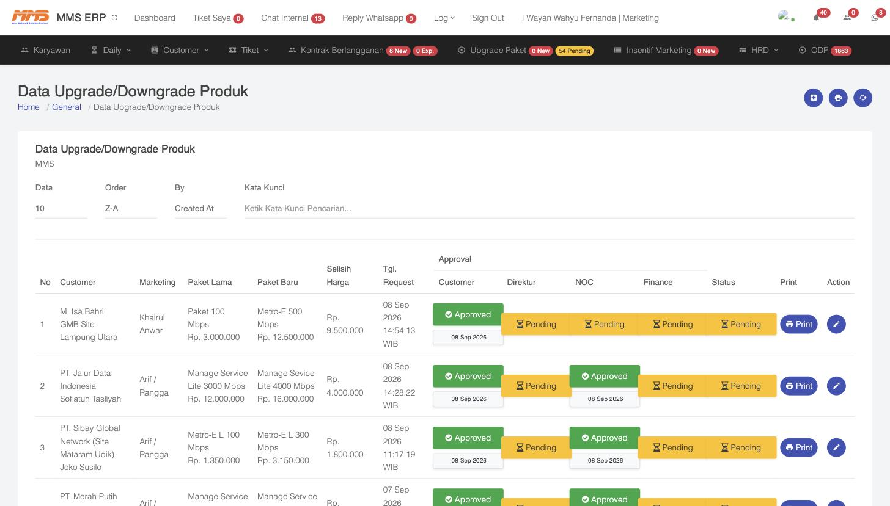
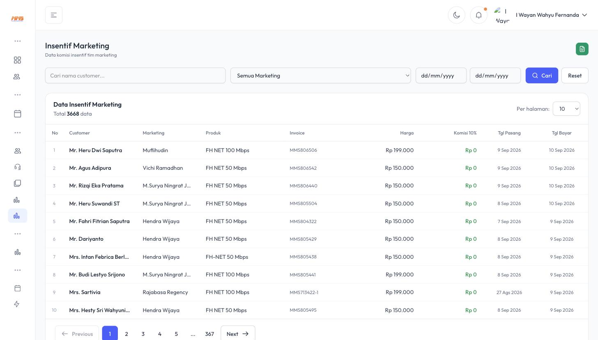

# 5. Upgrade/Downgrade Paket & Insentif Marketing

## 5.1 Upgrade/Downgrade Paket

Pelanggan yang ingin menaikkan (upgrade) atau menurunkan (downgrade) kecepatan/paket langganannya diajukan melalui menu **Customer → Upgrade Request**, lalu diproses dan dipantau melalui menu **Upgrade Paket**.



### 5.1.1 Struktur Data

| Kolom | Keterangan |
|---|---|
| **Customer** | Nama pelanggan yang mengajukan |
| **Marketing** | Marketing yang menangani akun tersebut |
| **Paket Lama** → **Paket Baru** | Perbandingan paket sebelum & sesudah, lengkap dengan harga |
| **Selisih Harga** | Kenaikan/penurunan biaya bulanan |
| **Tgl. Request** | Tanggal pengajuan |

### 5.1.2 Alur Persetujuan (Approval) Berjenjang

Setiap permintaan upgrade/downgrade **wajib melalui 4 tahap persetujuan** sebelum dieksekusi teknisi:

```
Customer (konfirmasi permintaan)
      │
      ▼
Direktur (approval kebijakan/manajemen)
      │
      ▼
NOC — Network Operations Center (approval kesiapan teknis/jaringan)
      │
      ▼
Finance (approval penyesuaian tagihan)
      │
      ▼
Status: Selesai → Paket baru aktif
```

Setiap kolom approval menampilkan status **Approved** (hijau, dengan tanggal persetujuan) atau **Pending** (kuning, menunggu tindak lanjut). Jika salah satu approval masih Pending, proses upgrade **belum bisa dieksekusi**.

Tombol **Print** mencetak surat/berita acara upgrade, dan ikon **pensil (Action)** membuka form edit/approve permintaan.

> 💡 Alur berjenjang ini memastikan setiap kenaikan/penurunan paket sudah disetujui secara bisnis (Direktur), secara teknis memungkinkan (NOC — mis. bandwidth cukup), dan sudah disesuaikan tagihannya (Finance) sebelum benar-benar diaktifkan — sehingga tidak terjadi selisih penagihan.

## 5.2 Insentif Marketing (Komisi)

Menu **Insentif Marketing** menampilkan rekap komisi yang diperoleh tiap anggota tim marketing atas keberhasilan mereka mendatangkan pelanggan baru.



### 5.2.1 Struktur Data

| Kolom | Keterangan |
|---|---|
| **Customer** | Nama pelanggan hasil closing marketing tsb |
| **Marketing** | Nama marketing yang berhak atas komisi |
| **Produk** | Paket yang terjual |
| **Invoice** | Nomor invoice pertama pelanggan (acuan komisi) |
| **Harga** | Nilai tagihan/harga paket |
| **Komisi 10%** | Nominal komisi (contoh: 10% dari harga paket) |
| **Tgl Pasang** | Tanggal instalasi selesai |
| **Tgl Bayar** | Tanggal pelanggan membayar invoice pertamanya |

### 5.2.2 Cara Kerja

1. Ketika pelanggan yang didaftarkan seorang marketing (lihat [Bab 2](02-Kantor-Pemasaran-Marketing.md)) selesai dipasang dan **membayar invoice pertamanya**, sistem otomatis mencatat baris komisi baru di halaman ini.
2. Nominal komisi dihitung sebagai persentase (contoh pada sistem: **10%**) dari harga paket/invoice.
3. Data bisa difilter berdasarkan **nama customer**, **nama marketing**, atau **rentang tanggal**, memudahkan proses rekap gaji/insentif bulanan oleh HRD/Finance.
4. Tombol cetak (ikon dokumen hijau, pojok kanan atas) digunakan untuk mengekspor/mencetak laporan komisi.

> 🔗 **Keterkaitan dengan Penagihan:** Insentif marketing baru muncul/terhitung setelah invoice pelanggan **benar-benar dibayar** (lihat [Bab 4.3](04-Kontrak-dan-Penagihan.md#43-penagihan--riwayat-invoice)) — ini adalah insentif untuk mendorong marketing juga membantu memastikan pelanggan barunya melakukan pembayaran tepat waktu.
