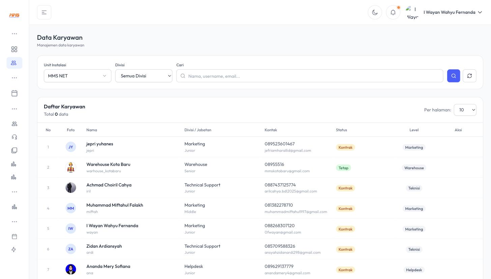
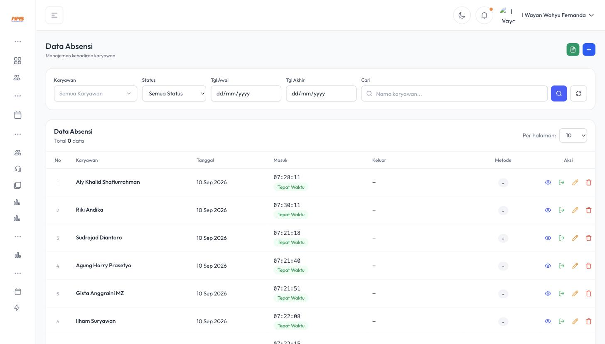

# 6. Internal MMS — Karyawan, HRD, & Operasional Harian

Bab ini mencakup modul-modul administratif yang menopang seluruh operasional MMS ERP, terutama dari sisi **Internal MMS (Pusat)** dalam mengelola karyawan lintas **Cabang** dan **POP**.

## 6.1 Data Karyawan

Menu **Karyawan** menampilkan seluruh data pegawai MMS dari berbagai divisi dan unit instalasi.

### 6.1.1 Filter

- **Unit Instalasi** — memilih cabang/kantor tertentu (mis. MMS NET)
- **Divisi** — Creative, Development, Direksi, Finance, Freelance, Helpdesk, HRD, **Marketing**, Officer, **Technical Support**, Warehouse

### 6.1.2 Kolom Data

| Kolom | Keterangan |
|---|---|
| **Foto** | Avatar/foto profil karyawan |
| **Nama** & **Username** | Identitas login |
| **Divisi / Jabatan** | Contoh: Marketing - Junior, Technical Support - Junior |
| **Kontak** | No. HP & email |
| **Status** | Kontrak / Tetap |
| **Level** | Peran sistem (Marketing, Teknisi, Warehouse, dsb) — level ini yang menentukan menu apa saja yang bisa diakses karyawan tsb saat login |

> Data ini penting karena **Level** setiap karyawan menentukan hak akses mereka di seluruh modul lain (misalnya hanya karyawan dengan Level "Teknisi" yang muncul sebagai pilihan PIC pada tiket instalasi di [Bab 3](03-Instalasi-Cabang-POP.md)).

## 6.2 Daily Activity & Komplain

Menu **Daily** mencatat aktivitas operasional harian:

- **Daily Activity** — log kegiatan harian tim (kunjungan, survey, aktivitas lapangan, dsb), ditampilkan juga sebagai ringkasan di Dashboard.
- **Komplain** — pencatatan keluhan pelanggan yang masuk melalui Helpdesk, dengan kolom Shift petugas, Customer, PIC/Telepon, isi Komplain, Teknisi penanggung jawab, Status (`On Progress`/`Done`), dan Tanggal Komplain. Ini terhubung dengan modul Tiket bila keluhan perlu ditindaklanjuti sebagai tiket resmi.

## 6.3 HRD — Administrasi Kepegawaian

Menu **HRD** menyediakan seluruh formulir administrasi kepegawaian, penting untuk karyawan lapangan di Cabang/POP yang sering bertugas keluar kantor.

### 6.3.1 Data Absensi

Menampilkan rekap kehadiran karyawan: **Tanggal, Jam Masuk** (dengan penanda `Tepat Waktu`/terlambat), **Jam Keluar**, dan **Metode** absensi (misal GPS/manual). Admin HRD dapat menambah data absensi manual via tombol **`+`**, atau mengunduh rekap via ikon dokumen hijau.

### 6.3.2 Form Lembur

Untuk pengajuan & approval lembur karyawan (relevan bagi teknisi yang bekerja di luar jam kerja normal untuk memenuhi SLA instalasi/gangguan).

### 6.3.3 Form Cuti / Izin

Pengajuan cuti tahunan atau izin tidak masuk kerja, biasanya melalui alur approval atasan.

### 6.3.4 Op. Kendaraan (Operasional Kendaraan)

Pencatatan penggunaan kendaraan operasional (mis. motor/mobil teknisi) untuk keperluan dinas — termasuk pemakaian BBM, perawatan, dsb.

### 6.3.5 Tugas Luar Kota

Form pengajuan & pencatatan penugasan karyawan ke luar kota (misalnya teknisi yang dikirim membantu instalasi di Cabang lain). Status ini juga muncul di Dashboard pada tabel **Absen Briefing** dengan label `Tugas Luar Kota`.

### 6.3.6 Peminjaman Barang

Pencatatan peminjaman inventaris/peralatan kerja (misalnya alat splicing fiber, tang crimping, laptop, dsb) antar karyawan atau antar cabang, agar aset perusahaan tetap terlacak.

## 6.4 Komunikasi Internal

- **Chat Internal** — fitur pesan instan antar karyawan/divisi di dalam sistem, termasuk chat khusus per tiket (lihat [Bab 3.2.3](03-Instalasi-Cabang-POP.md#323-detail-tiket-instalasi)).
- **Reply Whatsapp** — integrasi balasan pesan WhatsApp pelanggan langsung dari dalam sistem (tools/wa-rooms), memungkinkan CS/Marketing membalas chat pelanggan tanpa berpindah aplikasi.
- **Tiket Saya** — daftar tiket yang ditugaskan khusus kepada akun yang sedang login.
- **Log** — riwayat aktivitas/perubahan yang dilakukan pengguna dalam sistem.

## 6.5 Ringkasan Peran Internal MMS dalam Alur Instalasi–Penagihan

| Tahap | Peran Internal MMS (Pusat) |
|---|---|
| Instalasi | Menyediakan data ODP & memantau **Progress Tiket** semua cabang dari Dashboard terpusat |
| Kontrak | Menyimpan & mengarsipkan dokumen kontrak legal perusahaan |
| Penagihan | Finance memverifikasi pembayaran, mengelola **Riwayat Invoice** dan keputusan **Blokir** |
| Upgrade Paket | **Direktur, NOC, dan Finance** menjadi bagian approval berjenjang ([Bab 5.1.2](05-Upgrade-Paket-dan-Insentif.md#512-alur-persetujuan-approval-berjenjang)) |
| SDM | HRD mengelola absensi, cuti, lembur, dan penugasan seluruh karyawan Cabang & POP dari satu sistem terpusat |
